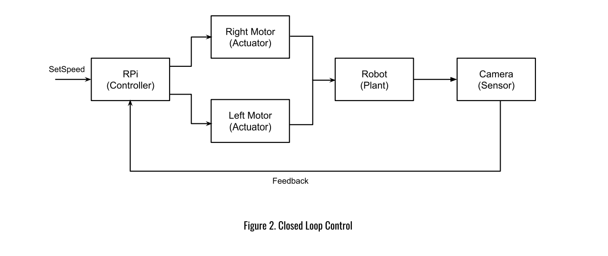
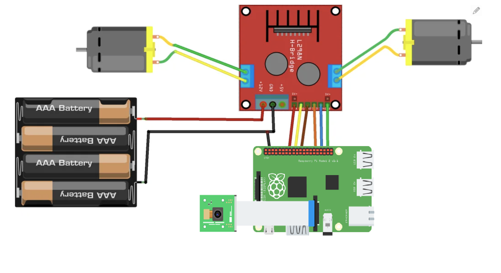
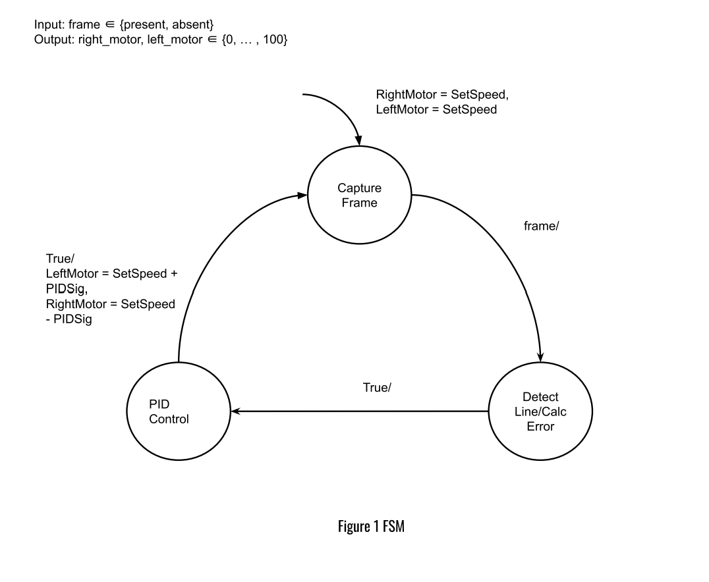

# Line Follower Robot Using Computer Vision
### *Project Description:*
In this project I am making a line-following robot that utilizes computer vision to detect a black line
and then follow it using a closed control loop with a PID controller. The robot has two motors, one
on each side. The motors are going to be controlled with PWM signals comming from the Raspberry Pi and they
will drive the robot forward and also control its direction.
The robot will detect a line in front of it using an onboard cheap low-resolution
camera (5MP).

### *Block Diagram*
This block diagram shows the main components that define a cyper physical system and highlights the closed loop implementation.

### *Hardware*
This diagram shows the physical connections between the main components on the robot.

### *Modelling with State Machine*

### *Demo*
https://youtube.com/shorts/l4ECYqf-E_A?feature=share
